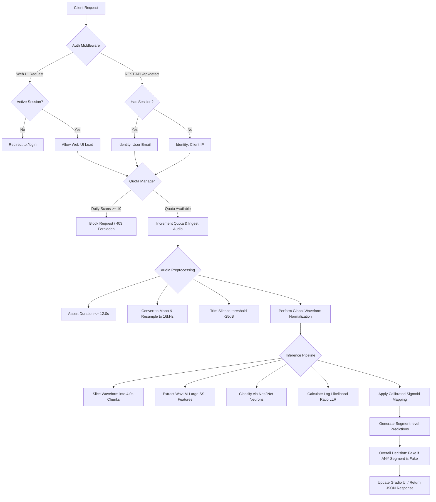

# DeepFense Audio Detector

DeepFense Audio Detector is a next-generation artificial intelligence deepfake and voice spoofing detection engine. It operates on a unified machine learning pipeline using a WavLM-Large self-supervised speech representation model front-end and a Nes2Net binary neural network classifier back-end.

This repository includes a FastAPI backend, a Gradio developer-themed terminal dashboard, and a direct JSON REST API endpoint. Access control is managed through session-based Google OAuth, and usage is regulated via a thread-safe local daily scan quota system.

---

## System Architecture and Logic Flow

The following diagram illustrates the end-to-end request lifecycle, security interceptors, preprocessing pipeline, and machine learning inference engine:



---

## Core Components

### 1. Security and Access Middleware
* **Session Middleware**: Handles encrypted user sessions via signed cookies.
* **Authentication Interceptor**: Enforces access control. All browser requests targeting the Gradio dashboard are redirected to `/login` if unauthenticated. Background WebSocket and layout requests are protected with 401 response codes.
* **Google OAuth**: Users authenticate using their Google accounts. If Google credentials are not configured in the environment, the application raises a 500 configuration error.
* **Logout Endpoint**: `/logout` terminates the session and deletes the client session cookie.

### 2. Quota Management System (`quota_manager.py`)
* Uses a local SQLite database (`quota.db`) to log daily user transactions.
* Enforces a strict limit of 10 scans per day.
* Quota consumption is atomic and handled in database transactions using upsert statements to prevent race conditions during concurrent requests.
* Identity resolution maps logged-in users to their verified email addresses, while anonymous REST API clients are mapped to their connection IP addresses.

### 3. Preprocessing Pipeline (`utils.py`)
* **Duration Filter**: Restricts input audio files to a maximum length of 12.0 seconds.
* **Resampling**: Standardizes all input signals to 16kHz mono audio.
* **Silence Trimming**: Applies voice activity detection to trim non-speech prefixes and suffixes using a -25dB threshold.
* **Global Normalization**: Normalizes the waveform to zero-mean and unit-variance. This step is critical to align the test speech features with the WavLM pre-training distribution.

### 4. Neural Network Inference Engine (`detector.py`)
* **WavLM-Large SSL Model**: Extracts rich temporal and speaker representations.
* **Nes2Net Classifier**: A binary classifier trained on synthetic voice artifacts, predicting whether the feature frame is genuine (bonafide) or artificial (spoof).
* **Segment-Level Division**: Splits the input wave into 4.0-second non-overlapping windows.
* **Decision Scoring**: Computes the Log-Likelihood Ratio (LLR):
  \[LLR = \text{logit}_{\text{bonafide}} - \text{logit}_{\text{spoof}}\]
  The LLR is mapped to a probability using a calibrated sigmoid function with a +13.0 offset. If any single segment exhibits an LLR below the classification boundary, the entire clip is flagged as manipulated.

---

## Configuration and Deployment

### Environment Setup
Create a `.env` file in the project root folder with the following variables:

```ini
PORT=7860
HOST=0.0.0.0
GOOGLE_CLIENT_ID=your_google_client_id
GOOGLE_CLIENT_SECRET=your_google_client_secret
GOOGLE_REDIRECT_URI=http://localhost:7860/login/google/callback
SESSION_SECRET=your_secure_random_session_secret
```

### Installation and Local Execution
1. Install dependencies:
   ```bash
   pip install -r requirements.txt
   ```
2. Start the application:
   ```bash
   python app.py
   ```
3. Open `http://localhost:7860` in a browser.

---

## Automated Deployment to Hugging Face Spaces

This repository is configured to automatically synchronize and deploy to Hugging Face Spaces using GitHub Actions.

### Setup Instructions
1. Create a new Space on [Hugging Face](https://huggingface.co/spaces):
   * Select **Docker** as the SDK.
   * Choose **Blank** template.
2. Generate a Hugging Face Write Token:
   * Go to your Hugging Face settings > Access Tokens.
   * Create a new token with **Write** role.
3. Configure GitHub Repository Secrets:
   * Go to your GitHub repository > Settings > Secrets and variables > Actions.
   * Add a new repository secret:
     * Name: `HF_TOKEN`
     * Value: Paste your Hugging Face Write token.
     * Name: `HF_SPACE_NAME`
     * Value: Paste your space name (e.g. `your-username/deepfense-detector`).
